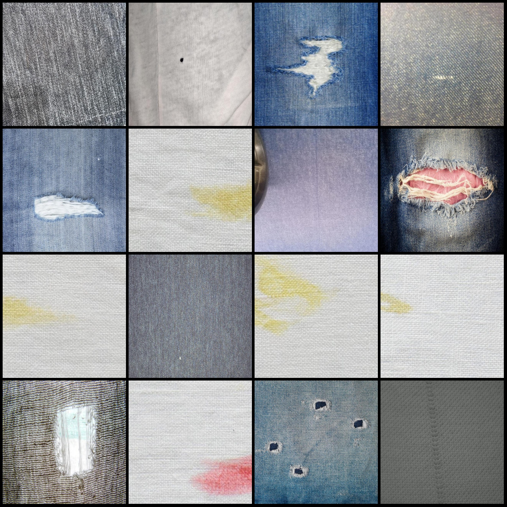
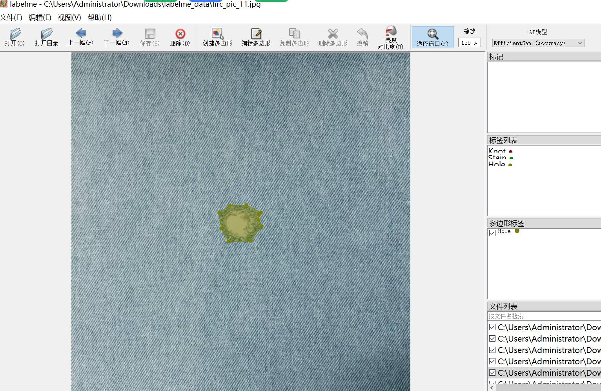

# Textile Defect Fabric Fabric Defect Labeling and Segmentation Dataset in LabelMe Format with 2433 Images, 4 Categories

Dataset format: LabelMe format (excluding mask files, only containing JPG images and corresponding JSON files)
Number of image files (JPG file count): 2433
Number of labeling files (JSON file count): 2433
Number of labeled categories: 4
Labeled category names: ["Hole", "Knot", "Line", "Stain"]
Each category labeled boxes count:  
Hole (holes) count = 956  
Knot (knots) count = 778  
Line (lines/patterns) count = 725  
Stain (stains) count = 982  
Total box count: 3441  
Used labeling tool: labelme=5.5.0  
Image resolution: 640x640  
Labeling rules: Polygon is drawn around the category
Important note: The dataset can be edited in LabelMe, but the JSON dataset needs to be converted into either mask or yolo or coco format for semantic segmentation or instance segmentation.
Special declaration: This dataset does not guarantee the accuracy of the trained models or weight files.
Image preview:
Annotation example:  
Randomly selected 16 images for demonstration:
Annotation drawing results:
LabelMe editing example image:

## Images

Here is a pay link on Stripe ( https://buy.stripe.com/3cs8yP7sY87d0vu9AB ). Please contact me lonlonago@foxmail.com after funding $89, and I will send you a complete data files , thank you!

